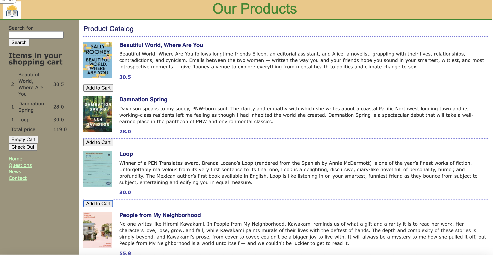
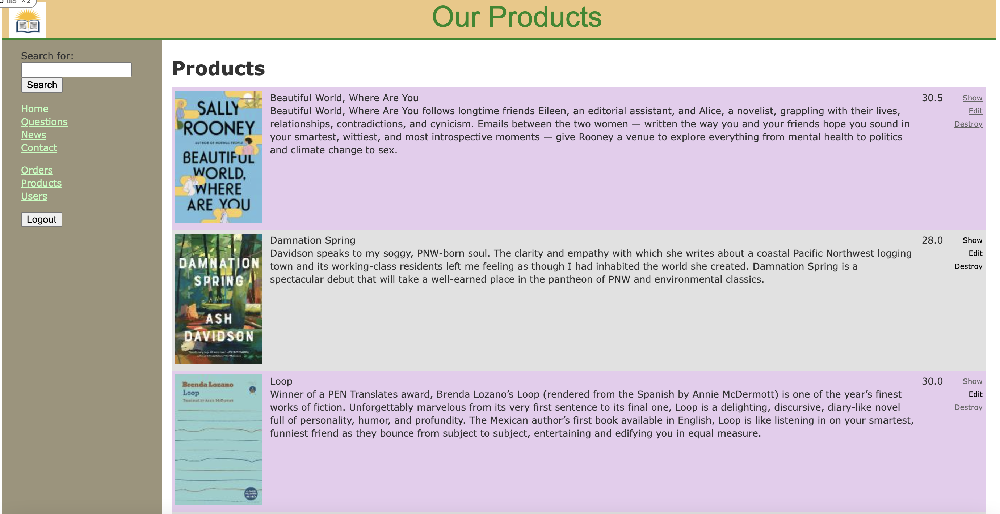

# README

An online Bookstore based on Ruby(3.0.0) on Rails. Shoppers can search by keyword to find the book they want, and add to shopping cart to check out. Admins can check and edit each product details, manage orders and users.

Related features and tech:

* Shopping cart: Ajax, Restful API

* User account: Authentication, password encryption(Bcrypt)

* Fuzzy Search

* Database used: sqlite 3
### Shopper's view:

### Admin's view:

